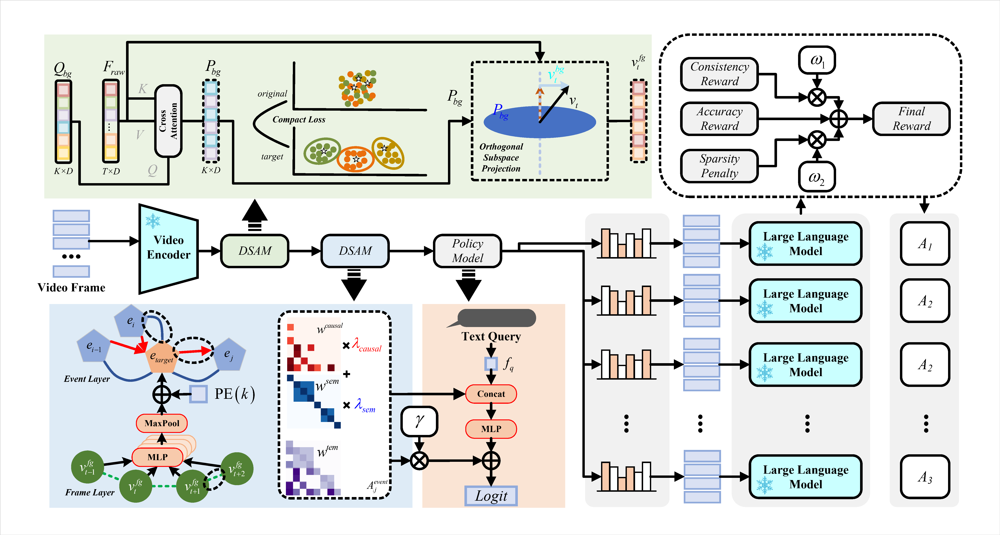

# DSCA-VL: Decoupled Semantic-Causal Alignment for Long-form Video Language Understanding

## 👀 Overview

To address a core challenge in long-form video understanding--semantic relevance without causal completeness under heavy temporal redundancy--DSCA-VL introduces a **Decoupled Semantic-Causal Alignment** framework. It first applies DSAM to disentangle redundant background patterns from causal foreground evidence, then uses CGRM to explicitly model hierarchical causal dependencies with a strict "cause-before-effect" constraint, and finally optimizes keyframe selection with GRPO in CMOS to produce a sparse, coherent, and interpretable evidence chain for MLLMs. Together with our current reproduction progress, the project has stably run a paper-aligned two-stage training loop (representation learning + policy optimization), validating the effectiveness of weakly supervised alignment and causal-consistency rewards for long-horizon video QA.

## 🏆 Performance

- Across four long-video benchmarks, DSCA-VL (Q2VL-7B) shows competitive overall results: **65.0** on EgoSchema, **53.5** on Video-MME-Long, **59.8/51.0** on LongVideoBench long-duration splits (180-600s / 900-3600s), and **64.3** on MLVU. On ultra-long video intervals, it reports up to **13.0%** improvement over the base model, with gains that become more evident as duration increases.
- Ablation studies further validate the necessity of the design: event-level clustering brings **+7.5%** on Video-MME-Long while reducing inference time from **87s** to **66s**; with CMOS-RL, improvements over the non-RL variant reach **23.4%** on Video-MME-Long and **25.2%** on LongVideoBench, showing that causal connectivity plus sparsity constraints consistently improve key evidence extraction.

